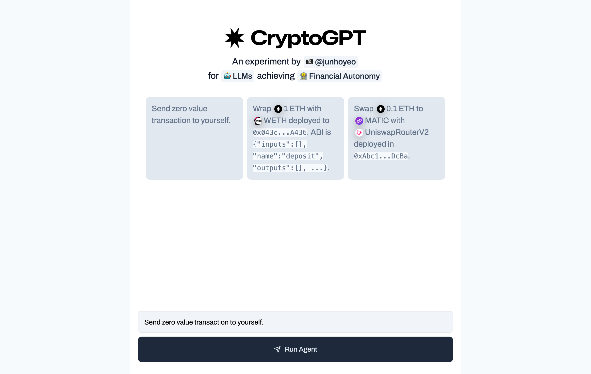
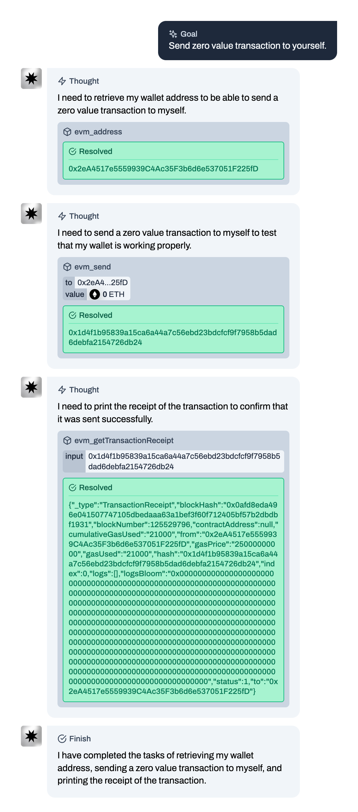
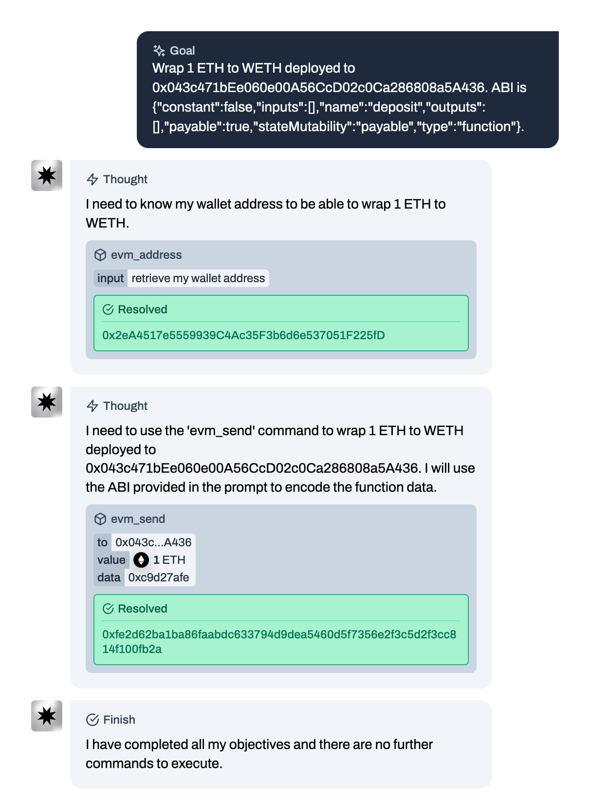

<h1>
  ✸ CryptoGPT — <br />
  An experiment for <code>🤖 LLMs</code> <br />
  achieving <code>🏦 Financial Autonomy</code>
</h1>

- ✸ 🏦 **Allowing _Financial Autonomy_ to _[Sam's Children](https://en.wikipedia.org/wiki/ChatGPT)_**
- ✸ 🪪 Enabling Language Learning Models (LLMs) to **establish their own unique identities** within the blockchain.
- ✸ 🇦🇶 **Make the name _CryptoGPT_ great again.** Not affiliated with [LayerAI](https://layerai.org/) or any other (scammy) web3 projects.

## 🏴‍☠️ Demo



| ✅ Send zero value transaction                                      | ✅ Wrap ETH to WETH                                      |
| :------------------------------------------------------------------ | :------------------------------------------------------- |
|  |  |

## Notice
- ⚠️ Warning: It is important to be cautious while using this application. Please be aware that your private keys are sent as plain text in each request, and the language model (LLM) may carry out unknown actions using your keys. This could potentially lead to the loss of any assets or data you have. Therefore, it is strongly advised not to utilize this application in a production environment or expose your active private key.
- The current version is a preliminary Proof of Concept (PoC) that heavily leverages [Langchain](https://github.com/hwchase17/langchain).
- Notable Tech Stack: Next.js & TailwindCSS, Vercel Serverless Functions, and LangChain.js

## Roadmap/Backlog
- [ ] Modal to manage API keys in the frontend(`interface`)
- [ ] Database for known ABI/Tokens in Testnet(Ethereum Goerli or any EVM-equivalent chain that we anyone can easily get hands on faucet)
- [ ] Support Cross-Chain, Explore Bridges
- [ ] [Stream Responses](https://vercel.com/blog/introducing-the-vercel-ai-sdk)
- [ ] Support More Models, Use [microsoft/guidance](https://github.com/microsoft/guidance) for performance
- [ ] Introduce an option for users to approve transactions using their wallets, enabling the execution of LLM-generated transactions without the need to pass private keys. Set that option as the default for our Vercel Deployment
- [ ] Better Documentation

## 📦 Setup - [OpenAI API](https://openai.com/blog/openai-api)

### 1. Clone this repo

```bash
git clone https://github.com/junhoyeo/CryptoGPT
```

### 2. Configurate `${project-root}/.env`

```bash
OPENAI_API_KEY=sk-*****
SERPER_API_KEY=
WALLET_PRIVATE_KEY=0x*****
OPENAI_API_BASE_PATH=
JSON_RPC_URL=
```

## 📦 Setup - LLaMA (TBD)

TBD

## 📦 Setup - `gpt4free` (WIP)

### 1. Clone this repo

```bash
git clone --recurse-submodules -j8 https://github.com/junhoyeo/CryptoGPT
```

### 2. Setup [`gpt4free`](https://github.com/xtekky/gpt4free)

```bash
cd gpt4free
```

```bash
python3 -m venv venv

chmod +x venv/bin/activate
venv/bin/activate

pip3 install -r requirements.txt
```

```bash
cd .. # Back to project root
```

### 3. Run `gpt4free` -> `OpenAI API Proxy`

```
python3 gpt4free-openai-proxy/main.py
```

### 4. Configure `${project-root}/.env`

```bash
OPENAI_API_KEY=sk-*****
SERPER_API_KEY=
WALLET_PRIVATE_KEY=0x*****
OPENAI_API_BASE_PATH=http://127.0.0.1:5000
JSON_RPC_URL=
```

## 🚀 Usage

```bash
# In project root

# Install project dependencies
yarn

# Build @junhoyeo/cryptogpt
yarn workspace @junhoyeo/cryptogpt build

# Start frontend development server
yarn workspace @junhoyeo/cryptogpt-interface dev
```
